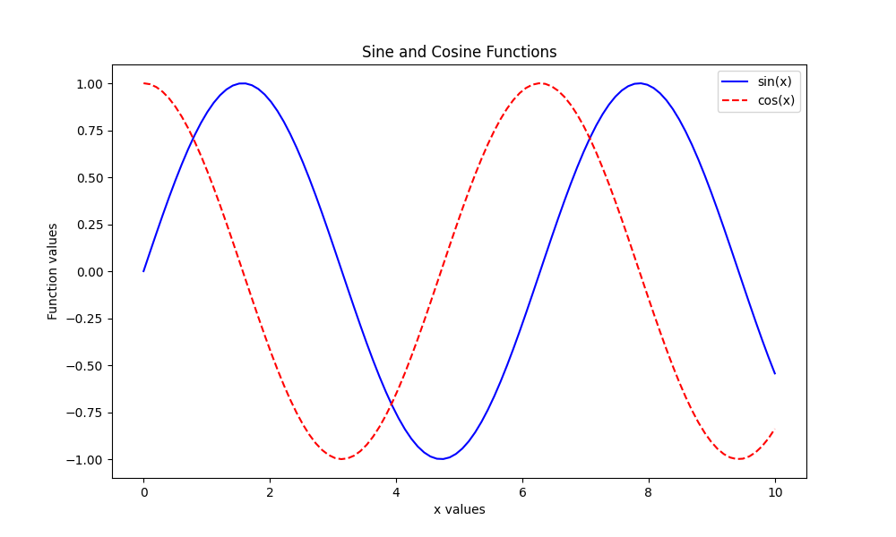

# 📊 Matplotlib Basic Plot Example

This repository contains a simple Python script demonstrating how to create basic line plots using Matplotlib and NumPy. 🐍📈

## 📝 Description

The script `matplotlib_basic_plot.py` generates and plots the sine and cosine functions over 100 evenly spaced points between 0 and 10.

It showcases how to:

- Generate data points with NumPy (`linspace`, `sin`, `cos`) ➡️
- Create line plots with Matplotlib 🎨
- Customize plot appearance (colors, line styles, labels, title) ✏️
- Add grid lines and legends 📋
- Save plots as image files 💾

## 🚀 Usage

1. Make sure you have Python installed (Python 3.6+ recommended). 🐍  
2. Install the required libraries if you don’t have them:

   ```bash
   pip install matplotlib numpy


